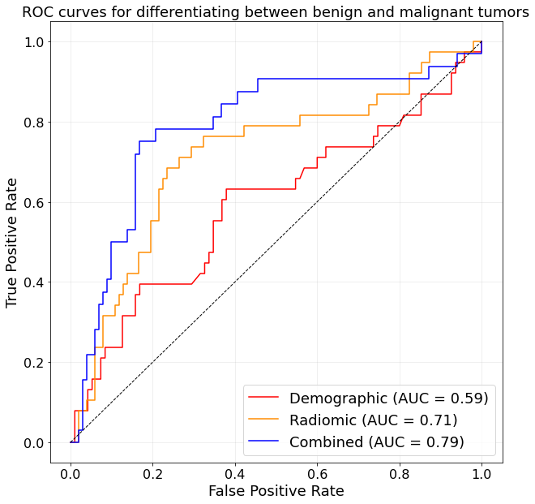

# Development of Machine Learning Models for the Characterization of Bone Tumors and Tumor-like Lesions based on X-ray Radiomics 

## Contains:
* **Images** -> folder with all Images stored as png files.
* **Images_nrrd** -> transformed Images to nrrd format for compatibility purposes.
* **Radiomics** -> folder with all extracted features by the pyradiomics extractor stored as csv.
* **Segmentations** -> contains all manually segmented tumors in '.nrrd' format.
* **src** -> Source folder with utils and categories files.

## Main Files
* **01_pyradiomics_feature_extraction.ipynb** -> Use this file to transform all Images to nrrd format and extract the features using pyradiomics.
* **02_feature_classification.ipynb** -> This file contains all training and validation results of the pyradiomics classification models.

## Architecture

## Results
